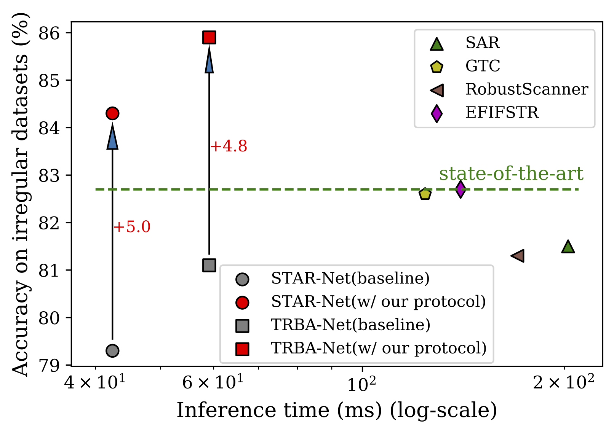

# Training Protocol Matters: Towards Accurate Scene Text Recognition with Training Protocol Searching
Our searched training protocol shows a good generalization capability over mainstream STR models and can significantly improve their recognition accuracy.
<p align="center">

</p>

## Dependency
- This work was tested with PyTorch 1.10.1, CUDA 11.3, python 3.9.7 and Ubuntu 16.04. 
- requirements : lmdb, pillow, torchvision, nltk, natsort
```
pip3 install lmdb pillow torchvision nltk natsort
```

## Prepare Datasets
<details>
<summary>Training datasets</summary>

1. [MJSynth (MJ)](http://www.robots.ox.ac.uk/~vgg/data/text/)[1]: 
    - Use `tools/create_lmdb_dataset.py` to convert images into LMDB dataset
    - [LMDB dataset BaiduNetdisk(passwd:n23k)](https://pan.baidu.com/s/1mgnTiyoR8f6Cm655rFI4HQ)
2. [SynthText (ST)](http://www.robots.ox.ac.uk/~vgg/data/scenetext/)[2]:
    - Use `tools/crop_by_word_bb.py` to crop images from original [SynthText](http://www.robots.ox.ac.uk/~vgg/data/scenetext/) dataset, and convert images into LMDB dataset by `tools/create_lmdb_dataset.py`
    - [LMDB dataset BaiduNetdisk(passwd:n23k)](https://pan.baidu.com/s/1mgnTiyoR8f6Cm655rFI4HQ)
3. [Training dataset in benchmarks](https://www.dropbox.com/sh/i39abvnefllx2si/AAAbAYRvxzRp3cIE5HzqUw3ra?dl=0&preview=validation.zip)
    - [LMDB dataset](https://www.dropbox.com/sh/i39abvnefllx2si/AAAbAYRvxzRp3cIE5HzqUw3ra?dl=0&preview=validation.zip) and rename it with **RealTrain**
    - the union of the training sets [IC13](http://rrc.cvc.uab.es/?ch=2)[3], [IC15](http://rrc.cvc.uab.es/?ch=4)[4], [IIIT](http://cvit.iiit.ac.in/projects/SceneTextUnderstanding/IIIT5K.html)[5], and [SVT](http://www.iapr-tc11.org/mediawiki/index.php/The_Street_View_Text_Dataset)[6].
4. [COCOText](https://rrc.cvc.uab.es/?ch=5&com=downloads)[11]
    - Download [Cropped word train and validation images and their annotations](https://rrc.cvc.uab.es/?com=downloads&action=download&ch=5&f=aHR0cHM6Ly9kYXRhc2V0cy5jdmMudWFiLmVzL3JyYy9DT0NPLVRleHQtd29yZHMtdHJhaW52YWwuemlw)
    - convert images into LMDB dataset by `tools/create_lmdb_dataset_COCOText.py` (remember to set **is_COCOText** by **True**) and rename it with **COCOText**
</details>

<details><summary>Evaluation datasets</summary>

- Evaluation datasets, LMDB datasets can be downloaded from [here](https://www.dropbox.com/sh/i39abvnefllx2si/AAAbAYRvxzRp3cIE5HzqUw3ra?dl=0&preview=evaluation.zip).
    1. [IIIT5K Words (IIIT)](http://cvit.iiit.ac.in/projects/SceneTextUnderstanding/IIIT5K.html)[5], 
    2. [Street View Text (SVT)](http://www.iapr-tc11.org/mediawiki/index.php/The_Street_View_Text_Dataset)[6], 
    3. [ICDAR 2003 (IC03)](http://www.iapr-tc11.org/mediawiki/index.php/ICDAR_2003_Robust_Reading_Competitions)[7], 
    4. [ICDAR 2013 (IC13)](http://rrc.cvc.uab.es/?ch=2)[3], 
    5. [ICDAR 2015 (IC15)](http://rrc.cvc.uab.es/?ch=4)[4], 
    6. [Street View Text-Perspective (SVTP)](http://openaccess.thecvf.com/content_iccv_2013/papers/Phan_Recognizing_Text_with_2013_ICCV_paper.pdf)[8], 
    7. [CUTE80 (CUTE)](http://cs-chan.com/downloads_CUTE80_dataset.html)[9].
</details>

<details><summary>Structure of `data` directory</summary>

- The structure of `data` directory is
    ```
    data
    ├── charset_36.txt
    ├── evaluation
    │   ├── CUTE80
    │   ├── IC03_860
    │   ├── IC03_867
    │   ├── IC13_857
    │   ├── IC13_1015
    │   ├── IC15_1811
    │   ├── IC15_2077
    │   ├── IIIT5k_3000
    │   ├── SVT
    │   └── SVTP
    ├── training
    |   ├── Realistic
    │   │   ├── COCOText
    │   │   └── RealTrain
    |   ├── Synthetic
    │   |   ├── MJ
    │   │   │   ├── MJ_test
    │   │   │   ├── MJ_train
    │   │   │   └── MJ_valid
    │   │   └── ST
</details>

## Pretrained Models
|Model|IIIT5K|SVT|IC03_867|IC13_1015|IC15_2077|SVT-P|CUTE80|
|:-:|:-:|:-:|:-:|:-:|:-:|:-:|:-:|
|CRNN([ckp](https://github.com/VDIGPKU/storage/releases/download/str.0.0.1/CRNN.pth))|93.9|89.2|93.7|92.3|78.6|80.5|81.6|
|STAR-Net([ckp](https://github.com/VDIGPKU/storage/releases/download/str.0.0.1/STARNet.pth))|95.8|94.1|94.9|94.1|82.9|85.3|89.9|
|TRBA([ckp](https://github.com/VDIGPKU/storage/releases/download/str.0.0.1/TRBA.pth))|96.6|95.5|96.5|95.5|84.4|89.9|90.3|
 
## Training and evaluation
### Try to train and test TRBA (**T**PS-**R**esNet-**B**iLSTM-**A**ttn) [13]. 
```
CUDA_VISIBLE_DEVICES=0 python3 train.py \
--Transformation TPS --FeatureExtraction ResNet --SequenceModeling BiLSTM --Prediction Attn
```
```
CUDA_VISIBLE_DEVICES=0 python3 test.py \
--Transformation TPS --FeatureExtraction ResNet --SequenceModeling BiLSTM --Prediction Attn \
--saved_model <path to checkpoint>
```

<details>
<summary>Test CRNN[10] model</summary>

```
CUDA_VISIBLE_DEVICES=0 python3 train.py \
--Transformation None --FeatureExtraction VGG --SequenceModeling BiLSTM --Prediction CTC 
```
</details>

<details>
<summary>Test STAR-Net[12] model</summary>

```
CUDA_VISIBLE_DEVICES=0 python3 test.py \
--Transformation TPC --FeatureExtraction ResNet --SequenceModeling BiLSTM --Prediction CTC \
--saved_model ./saved_models/STARNet/best_accuracy.pth
```
</details>


<details>
<summary> Run demo with pretrained model </summary>

1. Download pretrained model from [here](https://github.com/VDIGPKU/storage/releases/download/str.0.0.1/TRBA.pth)
2. Add image files to test into `demo_image/`
3. Run demo.py
```
CUDA_VISIBLE_DEVICES=0 python3 demo.py \
--Transformation TPS --FeatureExtraction ResNet --SequenceModeling BiLSTM --Prediction Attn \
--image_folder demo_image/ \
--saved_model TRBA.pth
```
</details>

## Citation
If you use our code/model, please consider to cite our paper [Training Protocol Matters: Towards Accurate Scene Text Recognition via Training Protocol Searching]().
```
@article{chu2022training,
  title={Training Protocol Matters: Towards Accurate Scene Text Recognition via Training Protocol Searching}, 
  author={Xiaojie Chu and Yongtao Wang and Chunhua Shen and Jingdong Chen and Wei Chu},
  journal={arXiv preprint arXiv:2203.},
  year={2022}
}
```

## License

The project is only free for academic research purposes, but needs authorization for commerce. For commerce permission, please contact wyt@pku.edu.cn.


## Acknowledgements
This implementation has been based on these repository
[deep-text-recognition-benchmark](https://github.com/clovaai/deep-text-recognition-benchmark) and 
[ABINet](https://github.com/FangShancheng/ABINet).

<details>
<summary> Reference </summary>
<!-- ## Reference -->
[1] M. Jaderberg, K. Simonyan, A. Vedaldi, and A. Zisserman. Synthetic data and artificial neural networks for natural scenetext  recognition. In Workshop on Deep Learning, NIPS, 2014. <br>
[2] A. Gupta, A. Vedaldi, and A. Zisserman. Synthetic data fortext localisation in natural images. In CVPR, 2016. <br>
[3] D. Karatzas, F. Shafait, S. Uchida, M. Iwamura, L. G. i Big-orda, S. R. Mestre, J. Mas, D. F. Mota, J. A. Almazan, andL. P. De Las Heras. ICDAR 2013 robust reading competition. In ICDAR, pages 1484–1493, 2013. <br>
[4] D. Karatzas, L. Gomez-Bigorda, A. Nicolaou, S. Ghosh, A. Bagdanov, M. Iwamura, J. Matas, L. Neumann, V. R.Chandrasekhar, S. Lu, et al. ICDAR 2015 competition on ro-bust reading. In ICDAR, pages 1156–1160, 2015. <br>
[5] A. Mishra, K. Alahari, and C. Jawahar. Scene text recognition using higher order language priors. In BMVC, 2012. <br>
[6] K. Wang, B. Babenko, and S. Belongie. End-to-end scenetext recognition. In ICCV, pages 1457–1464, 2011. <br>
[7] S. M. Lucas, A. Panaretos, L. Sosa, A. Tang, S. Wong, andR. Young. ICDAR 2003 robust reading competitions. In ICDAR, pages 682–687, 2003. <br>
[8] T. Q. Phan, P. Shivakumara, S. Tian, and C. L. Tan. Recognizing text with perspective distortion in natural scenes. In ICCV, pages 569–576, 2013. <br>
[9] A. Risnumawan, P. Shivakumara, C. S. Chan, and C. L. Tan. A robust arbitrary text detection system for natural scene images. In ESWA, volume 41, pages 8027–8048, 2014. <br>
[10] B. Shi, X. Bai, and C. Yao. An end-to-end trainable neural network for image-based sequence recognition and its application to scene text recognition. In TPAMI, volume 39, pages2298–2304. 2017. <br>
[11] Veit, Andreas, et al. "Coco-text: Dataset and benchmark for text detection and recognition in natural images." arXiv preprint arXiv:1601.07140 (2016). <br>
[12] Wei Liu, Chaofeng Chen, Kwan-Yee KWong, Zhizhong Su, and Junyu Han. Star-net: A spatial attention residue network for scene text recognition. In BMVC, volume 2, 2016. <br>
[13] Baek, Jeonghun, et al. "What is wrong with scene text recognition model comparisons? dataset and model analysis." Proceedings of the IEEE/CVF International Conference on Computer Vision. 2019. <br>
</details>

